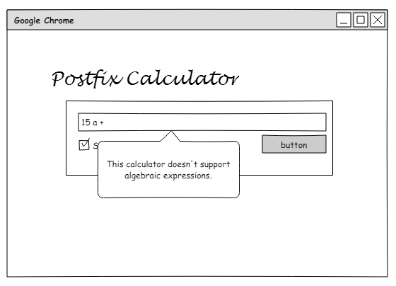

## Homework 2
This homework assignment was about learning the basics of javascript application development. Building off the skills from homework 2 we will be writing a web application in javascript while still using HTML, CSS, and Bootstrap for the page layout.

* You can find a description of this project [here]()
* Demo located [here](https://devonsmith.github.io/cs460/hw2/demo).
* The repository that contains this code can be found [here](https://bitbucket.org/devonsmith7696/cs460-project-repository)
* https://bitbucket.org/devonsmith7696/cs460-project-repository.git

### Step 1: Setup the environment

The first step for creating this project was to add additional directories to the assignment repository for this class.

```bash
mkdir HW2
cd HW2
mkdir js
mkdir css
```

Then I needed to create a new feature branch on the git repository for this homework assignment. I also need to checkout that branch so I can edit the code separate from my homework 1 work.

```bash
git checkout -b hw2
```

This command created a new branch and checked it out all in one step. Now that I have the new branch created I can start making the files for this code branch.

```bash
touch index.html
touch css/style.css
git add *
git commit -m "Initial code for HW2."
git push origin hw2
```

That should be a good start. I'm going to initially start by placing my javascript code at the end of my body tag in the HTML and eventually move it to a specific .js file.

### Step 2: Think of a project and design it

I've been working on all of the assignments more or less at the same time. I get the initial bit of code roughly created for all of the projects and have been slowly refining the projects and homework assignments over time. In Homework 3 we're implementing a project from CS260: Data Structures in C# instead of in Java. For this project I decided to do the same thing. I'm going to implement Homework 3 in JavaScript.

The project for Homework 3 is to implement a stack-based calculator that uses postfix a.k.a. reverse polish notation. This is a pretty typical project you find in a data structures class and should allow me to learn some of the ins and outs of the JavaScript type system. I will of course create an application with a user interface written in java and will use the web page to provide feedback to the user and help with the usage of the calculator.

### Step 3: Wireframe Creation

As the first part of the application design phase I am creating a wireframe that will act as the basic layout for my application and will guide my development. I know that I'm going to use HTML, CSS, Bootstrap, Javascript, JQuery, and Popper.js as they are all in my toolkit for this class. So I'm going to try and design something that can be done with those libraries and frameworks.

For my design I used the free software Pencil Project by Evolus Co. Ltd. This tool allows you to create great application wire frames and is open source. You can get it [here](http://pencil.evolus.vn/). Here is the design I came up with:

Here are the wireframes:

#### Normal Operation


#### Without "Show stack" checked


#### Input Error




### Step 4: Creating the Working Page

The first step after the design phase was to create a basic web page that would act as the user interface for the application. So I started by creating the HTML and CSS layout of the page.

```html
<!DOCTYPE html>
<html>
    <head>
        <link rel='stylesheet' href='https://maxcdn.bootstrapcdn.com/bootstrap/3.3.7/css/bootstrap.min.css'>
        <link rel='stylesheet' href='css/style.css'>
        <title>Online Postfix Calculator</title>
    </head>
    <body>
        <!-- Title row for the calculator -->
        <div class='row'>
            <div class='col-sm-12'>
                <h1 class='huge-text'>Postfix Calculator</h1>
            </div>
        </div>
        <!--  end of title row -->
        <!-- row for the calculator form -->
        <div class='row'>
            <div class='col-sm-3'>
                &nbsp;
            </div>
            <!-- div containing the form -->
            <div class='col-sm-6 calc-form'>
                <p class='text-right help-button'>
                    <a href='#' data-toggle='modal' data-target='#modalHelp'>
                        <span class='glyphicon glyphicon-question-sign'></span>
                    </a>
                </p>
                <div class='form'>
                <p>Postfix calculator:</p>
                <!-- test input for the postfix expression -->
                <input type='text' id='user-input' class='form-control' 
                onkeyup='validate(this)' onkeypress="if(event.keyCode==13)calculate();"> 
                <div id='instructions' style='visibility: hidden;'></div>
                <!-- button for calculating -->
                <div class='button-row checkbox'>
                    <label><input id='showStack' type='checkbox' value='' onclick='checkState()'>Show stack</label>
                    <span class='button-mover'>
                        <button class='btn btn-primary' type='submit' onclick='calculate()'>Calculate</button>
                    </span>
                </div>
                <!-- output field for solutions and error messages -->
                <div id='output'></div>
                </div>
            </div>
            <div class='col-sm-3'>
                &nbsp;
            </div>
        </div>
        <!-- row for printing the contents of the stack after each operating -->
        <div class='row'>
            <div class='col-sm-3'>
                &nbsp;
            </div>
            <!-- column for output -->
            <div id='outputbox' class='col-sm-6'>
                <div id='trace'></div>
            </div>
            <div class='col-sm-3'>
                &nbsp;
            </div>
        </div>
        <!-- end of page -->

        <!-- scripts at the end of the body to limit load time -->
        <script src='https://code.jquery.com/jquery-3.2.1.slim.min.js'
            integrity=
            'sha384-KJ3o2DKtIkvYIK3UENzmM7KCkRr/rE9/Qpg6aAZGJwFDMVNA/GpGFF93hXpG5KkN' 
            crossorigin="anonymous"></script>
        <script>
            window.jQuery || document.write("<script src='js/jquery.min.js'><\/script>")
        </script>
        <script 
            src='https://maxcdn.bootstrapcdn.com/bootstrap/3.3.7/js/bootstrap.min.js'>
        </script>
        <!-- IE10 viewport hack for Surface/desktop Windows 8 bug -->
        <script src="js/ie10-viewport-bug-workaround.js"></script>
        <!-- popper for inputs that don't pass validation -->
        <script src="js/popper.min.js"></script>
    </body>
</html>
```
#### CSS
To get the page looking the way I wanted it to I needed to add some custom CSS. Part if this was choosing a cursive font to be used with the page layout. I chose to use "Lobster" from Google Web Fonts. I included this in my CSS file named style.css.

```css
/* import the title font */
@import url('https://fonts.googleapis.com/css?family=Lobster');
```

Then I created the CSS to get the page looking the way I wanted it. This was iterated on some throughout the project as I created new code or adjusted how things looked.

```css
body {
    background-color: #4A1058;
    padding: 5rem;
}

h1{
    font-family: 'Lobster', cursive;
    color: #fff;
}

.tabbed{
    margin-left: 5em;
}

.huge-text{
    font-size: 8em;
}

.calc-form{
    margin-top: 5rem;
    background-color: #fff;
    border-radius: 10px;
    padding: 1rem 1rem;
}

.output{
    margin-top: 5rem;
    background-color: #fff;
    border-radius: 10px;
    padding: 2rem;
}

.button-row{
    margin-top: 1rem;
}

.red-text {
    color: #f00
}

#instructions {
    position: absolute;
    background: #FFC107;
    color: black;
    width: 400px;
    border-radius: 0 0 1rem 1rem;
    box-shadow: 0px 0px 2px rgba(0,0,0,0.5);
    padding: 10px;
    text-align: left;
    z-index: 100;
}
.help-button{
    font-size: 2rem;
    color: #4A1058;
    margin: 0;
}

.form{
    padding: 1rem 1rem;
}

.modal-dialog{
    margin-top: 10rem;
}

.btn{
    float: right;
}

.img-left{
    float: left;
}
```
##### Calculate Function

After the main parts of the page were created I started writing the JavaScript code that would run the application. Initially I started to create the code for the calculator function.

```js
// process the expression
function calculate(){
    // input for the calculator
    // good input for testing: 15 7 1 1 + - / 3 * 2 1 1 + + -
    var string = document.getElementById("user-input").value;
    // trim the white space off the ends of the string then create 
    // an array split on the spaces.
    var expression = string.trim().split(" ");
    var stack = [];

    // a string for outputting error messages
    var errorMessage = "";
    // start by making the output box for the stack trace styled.
    var trace = document.getElementById("trace");
    
    if(document.getElementById("showStack").checked == true){
        trace.innerHTML = "<p><strong>Contents of the stack:</strong></p>";
        $('#outputbox').addClass('output');
    }
    else {
        trace.innerHTML = "";
        $("#outputbox").removeClass("output");
    }

    // loop through the items in the input and process them.
    for (var i in expression){
        // if the item is a valid number push it onto the stack.
        // Checks for and operand and validates it as a number.
        if (/(?:\d*\.)?\d+/.test(expression[i]) && isNaN(expression[i]) == false){
            var stackElements = "";
            stack.push(expression[i]);
            if(document.getElementById("showStack").checked == true){
                for (var i in stack){
                    stackElements += stack[i] + ' ';
                }
                trace.innerHTML += "<div class='tabbed'><p>After push operation: " 
                                + stackElements
                                + "</p></div>";
            }

        }
        // otherwise it's an operator and needs to be processed.
        // An operation can only be performed if there are two or more items on the stack.
        else if (stack.length > 1 && /[-+*\/]{1}/.test(expression[i])) {
            // variables for non-comutative operations.
            var a = 0;
            var b = 0;
            // select a case based on the operator
            switch(expression[i]){
                // Explicitly convert items to numbers to prevent string operations.
                // Addition is commutative
                case '+':
                    stack.push(Number(stack.pop()) + Number(stack.pop()));
                    break;
                // Subtraction is not commutative
                case '-':
                    b = Number(stack.pop());
                    a = Number(stack.pop());
                    stack.push(a-b);
                    break;
                // Multiplication is commutative
                case '*':
                    stack.push(Number(stack.pop())*Number(stack.pop()));
                    break;
                // division is not commutative
                case '/':
                    b = Number(stack.pop());
                    a = Number(stack.pop());
                    // check for divide by zero
                    if (b == 0){
                        errorMessage = "<span class='red-text'>" 
                                        + "<span class='glyphicon glyphicon-exclamation-sign'></span> " 
                                        + "Input error: Cannot divide by zero!"
                                        + "</span>";
                        document.getElementById("output").innerHTML = errorMessage;       
                        return;
                    }
                    stack.push(a / b);
                    break;
                default:
                    break;    
            }
            if(document.getElementById("showStack").checked == true){
                // create an ouput string for the stack elements.
                var outputString = "";
                for (var j in stack){
                    
                    outputString += stack[j] + ' ';
                }
                // place the stack information into the trace.
                trace.innerHTML += "<div class='tabbed'><p>After " 
                                + expression[i] 
                                + " operation:    " 
                                + outputString;
            }
        }
        // the input from the user created an invalid state.
        // not enough items in the stack to perform an operation.
        else {
            errorMessage = "<span class='red-text'>" 
                            + "<span class='glyphicon glyphicon-exclamation-sign'></span> "
                            + "An error has occurred: Please check your expression."
                            + "</span>";
            document.getElementById("output").innerHTML = errorMessage;
            return;
        } 
    } 
    document.getElementById("output").innerHTML = "Answer: " + stack.pop();  
}
```
#### Input Validation Function
Once I had the code for the actual calculator written I started to write the code for input validation on the text box for the calculator. For this I created a validate() method that was fired onKeyUp.

```js
// will validate the user's input field.
function validate(referenceElement){
    if (referenceElement.value.search(/[a-zA-Z,]/) > -1){
        var instructions = "<p>You appear to have made a mistake!</p>" 
                         + "<p>Please remember the following:</p>"
                         + "<ol><li>You cannot use letters</li>"
                         + "<li>You must use <a href='https://en.wikipedia.org/wiki/Reverse_Polish_notation'>RPN</a></li>"
                         + "<li>Do not include commas in large numbers</li></ol>";
        document.getElementById("instructions").innerHTML = instructions;
        document.getElementById("instructions").style.visibility = "visible";
    }
    else {
        document.getElementById("instructions").innerHTML = "";
        document.getElementById("instructions").style.visibility = "hidden";
    }
}
```
This code will create the popper dynamically and could be altered to provide more validation checking if needed.

#### User Friendly Check Box

After that was created I needed to implement the checkbox that would allow the user to choose if they wanted to see the contents of the stack as the application was being run. This will check to see if the user has unchecked the checkbox and will clear the stack printout.

```js
// checks the status of the show stack checkbox
function checkState(){
    if(document.getElementById("showStack").checked == false){
        document.getElementById("trace").innerHTML = "";
        $("#outputbox").removeClass("output");
        
    }
}
```

#### Adding Some Help

After I had the core application up and running I added the instructions and about information in a help menu which can be accessed by clicking on a question mark in the top right of the calculator body. This will take you to a modal menu that will provide you with instructions on how to use the calculator and information about the calculator itself. For this I used the modal classes from Bootstrap.

```html
 <!-- Modal Help -->
<div class='modal fade' id='modalHelp' role='dialog'>
<div class='modal-dialog'>

    <!-- Modal content-->
    <div class='modal-content'>
    <div class='modal-header'>
        <button type='button' class="close" data-dismiss="modal">&times;</button>
    </div>
    <div class='modal-body'>
        <ul class='nav nav-pills'>
            <li class='active'><a data-toggle='pill' href='#Instructions'>Instructions</a></li>
            <li><a data-toggle='pill' href='#Technologies'>Technologies</a></li>
            <li><a data-toggle='pill' href='#About'>About</a></li>
        </ul>
        <!-- Application help container -->        
        <div class='tab-content'>
            <!-- general calculator instructions -->
            <div id='Instructions' class='tab-pane fade in active'>
                <h3>Instructions</h3>
                <p>
                    This is a reverse Polish notation, a.k.a. postfix, 
                    calculator. Postfix is a mathematical notation in 
                    which the operators follow the operands. 
                    This calculator will perform the following operations:
                </p>
                <ul>
                    <li>Addition (+)</li>
                    <li>Subtraction (-)</li>
                    <li>Multiplication (*)</li>
                    <li>Division (/)</li>
                </ul>
                <p>
                    Postfix notation does not require parentheses in 
                    mathematical expressions. This calculator can process 
                    mathematical strings using only numbers along with 
                    +, - , *, and / symbols.
                </p>
                <p>
                    A valid input will have integer or floating point numbers 
                    and mathematical operators separated by spaces
                    in postfix form.
                </p>
                <h4>Example</h4>
                <p>
                    The following is an example of an expression postfix notation. 
                    This example comes from Wikipedia.
                </p>
                <p>
                    The expression ((15 / (7 - (1 + 1))) * 3) - (2 + (1 + 1)) 
                    can be expressed with postfix notation as 
                    15 7 1 1 + - / 3 * 2 1 1 + + -
                </p>
                <p>
                    This type of notation was commonly used in calculators because 
                    it was simple to implement using      a basic stack. This 
                    project attempts to replicate that behavior using JavaScript. 
                    To see how the calculator is using the stack to solve a postfix 
                    expression, check "Show stack."
                </p>

            </div>
            <!-- summary of technologies used -->
            <div id='Technologies' class='tab-pane fade'>
                <h3>Technologies</h3>
                <h4>HTML 5</h4>
                <p>This page uses HTML 5 for the main application body.</p>
                <h4>Bootstrap</h4>
                <p>
                    Bootstrap is toolkit for developing applications with HTML, CSS, 
                    and JavaScript which allows for the quick development of web 
                    applications without the need to implement all the fundamental
                    UI elements. It provides a number of classes and JavaScript 
                    elements used in this page.
                </p>
                <h4>JavaScript</h4>
                <p>
                    The logic of this application is built on JavaScript. The 
                    project allowed me to familiarize myself
                    with JavaScript and the common libraries used for developing 
                    rich web applications.
                </p>
                <h4>JQuery</h4>
                <p>
                    JQuery is a JavaScript library that provides a number of selectors 
                    and HTML document traversal mechanisms
                    which can be used to manipulate elements in an HTML document.
                </p>
                <h4>Popper.js</h4>
                <p>
                    Popper.js is a small popup and tooltip library that allows for the 
                    easy creation of tooltips and popups for web applications.
                </p>
                <h4>Glyphicons</h4>
                <p>
                    Glyphicons is a collection of monochromatic icons. These are included 
                    in Bootstrap 3 and also available 
                    <a href='http://glyphicons.com/'>here</a>.
                </p>
            </div>
            <!-- About software -->
            <div id='About' class='tab-pane fade'>
                <h3>About</h3>
                <p>Author: Devon Smith</p>
                <p>Created for CS460 at Western Oregon University, Fall 2017.</p>
                <P>
                    You can find the project description 
                    <a href='http://www.wou.edu/~morses/classes/cs46x/assignments/HW2.html'>here</a>.
                </P>
            </div>
        </div>
    </div>
    </div>
</div>
</div>

```

#### The Fully Functional Page

This is an example of the fully functional web page in the various states during error checking.


### Step 5: Merging Back to Master

Now that the application was all tested and ready to be merged. I then used git to merge the information into master branch of my repository.
```bash
git add *
git commit -m "final code cleanup"
git push origin hw2
git checkout master
git merge hw2
git push origin master
```