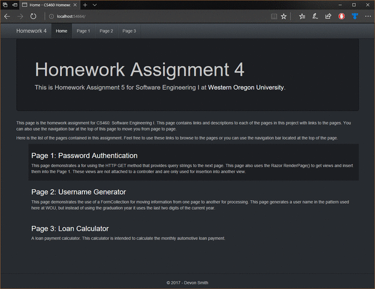

## Homework 4
This homework assignment was about creating our first .NET MVC application. The goal was to become familiar with the various ways .NET MVC canb be used to create rich web applications. I learned how to use Razor and how to integrate C# programming with web application development.

* You can find a description of this project [here](http://www.wou.edu/~morses/classes/cs46x/assignments/HW4.html)
* Demo *unavailable*
* The repository that contains this code can be found [here](https://bitbucket.org/devonsmith/cs460-project-repository)
* https://bitbucket.org/devonsmith/cs460-project-repository.git

### Step 1: Creation of an Empty MVC Project

I began by creating a directory in my CS460 repository and adding a directory for the new project. Then I started Visual Studio, created a new empty MVC application, and added my ```.gitignore``` file to the base directory of the project. This could be done in the root of the entire repository, but I prefer that each project be in their own self-sustaining directory so that I can easily branch them into smaller projects in the future if I find it beneficial.

### Step 2: Initial Setup and Creating the Home Page

#### Setting up the Layout

First, I added some links to pages for the menubar at the top of the page. I added the ```@HtmlActionLink()``` razorform elements to the menu. The menu allowed navigation, but provided no indication of the currently active page because by default the "active" class was not being placed on the active page. I solved this by adding a ```ViewContext``` check that allowed me to add the class to the appropriate menu element. This wasn't the first time I'd worked with .NET MVC; I worked with OrchardProject previously for content management, so I used the code I had created for that project here. I used a ternary operator to choose which class is attached to the ```<li>``` item.

```html
<div class="navbar-collapse collapse">
    <ul class="nav navbar-nav">
        <li class="@(ViewContext.RouteData.Values["Action"].ToString() == "Index" ? "active" : "")">
            @Html.ActionLink("Home", "Index", "Home", new { area = "" }, new { @id = "menu1" })
        </li><li class="@(ViewContext.RouteData.Values["Action"].ToString() == "Page1" ? "active" : "")">
            @Html.ActionLink("Page 1", "Page1", "Home", new { area = "" }, new { @id = "menu2" })
        </li>                    </li>
        <li class="@(ViewContext.RouteData.Values["Action"].ToString() == "Page2" ? "active" : "")">
            @Html.ActionLink("Page 2", "Page2", "Home", new { area = "" }, new { @id = "menu3" })
        </li>
        <li class="@(ViewContext.RouteData.Values["Action"].ToString() == "Page3" ? "active" : "")">
            @Html.ActionLink("Page 3", "Page3", "Home", new { area = "" }, new { @id = "menu4" })
        </li>
    </ul>
</div>
```
#### Changing the Default Boostrap Theme

Rather than reinvent the wheel, I went to [Bootswatch](https://bootswatch.com/) and found a theme I liked. All the  themes from Bootswatch are Open Source (MIT License) and provide previews and code samples. I used these to help me construct elements of my page. 

#### Creating the Home page.

After creating the menubar I moved onto the main part of the Index page. First I created the page body, which I did by creating the ```ActionListener``` for the home page in my ```HomeController.cs```.

```csharp
/// <summary>
/// ActionResult returns default view for home page.
/// </summary>
/// <returns></returns>
public ActionResult Index()
{
    return View();
}
```
I could then create the list of pages on the home page, which fulfilled the project requirement for a list.

```html
 <ul id="homepage-list">
        <li>
            <h3>@Html.ActionLink("Page 1: Password Authentication", "Page1", "Home")</h3>
            <span>
                This page demonstrates a for using the HTTP GET method that provides query strings to the
                next page. This page also uses the Razor RenderPage() to get views and insert them into
                the Page 1. These views are not attached to a controller and are only used for insertion
                into another view.
            </span>
        </li>
        <li>
            <h3>@Html.ActionLink("Page 2: Username Generator", "Page2", "Home")</h3>
            <span>
                This page demonstrates the use of a FormCollection for moving information from one page
                to another for processing. This page generates a username in the pattern used here at 
                WOU, but instead of using the graduation year it uses the last two digits of the current
                year.
            </span>
        </li>
        <li>
            <h3>@Html.ActionLink("Page 3: Loan Calculator", "Page3", "Home")</h3>
            <span>
                A loan payment calculator. This calculator is intended to calculate the monthly automotive
                loan payment.
            </span>
        </li>
    </ul>
```
By default this had a boring visual design, so I tried a number of alternate looks and even tried a description list. Ultimately I wasn't satisfied with any of these, so I decided theme the list using CSS.

```css
#homepage-list{
    list-style: none;
}
#homepage-list > li{
    padding: 0.5rem 1rem 2rem 1rem;
}
.hovered-list-item {
    background-color: #1c1e22;
}

```

To add a hover effect, I could have used JQuery to add a class to the ```<li>``` so I could create a CSS pseudo class for this process. Instead I opted to use JavaScript, not because it's the best way to implement the hover effect I wanted but rather I wanted to try to create the effect with JavaScript. 

```js
<script>
    $(document).ready(function () {
        $("#homepage-list > li").hover(function () {
            $(this).addClass("hovered-list-item");
        }, function () {
            $(this).removeClass("hovered-list-item");
        });
    });
</script>
```

### Step 3: Creating Page 1
The first real page created for this project uses query strings to get information from a form. The assignment specified that we couldn't use any of the Razor helpers, but instead had to implement the form ourselves using HTML. I wanted to used a single page that would swap out elements depending on the state of the form and whether or not the page is a post. As with the Home page creation, I started by adding the ```ActionListener``` to the ```HomeController.cs```.

```csharp
/// <summary>
/// Default action return from page 1.
/// </summary>
/// <returns></returns>
public ActionResult Page1()
{
    string email = Request.QueryString["email"];
    string password = Request.QueryString["password"];

    ViewBag.Email = email;
    ViewBag.Password = password;

    return View();
}
```
#### Creating the Main Page

I decided to write a basic demonstration of user authentication. I wanted to present the user with a form that would allow them to guess a static username and password. If they got the login correct, it would swap the page content to give them a message; if they failed to authenticate correctly, it would swamp the page content for a failure message. I started by creating the base page, and planned to insert other pages as partial views depending on if they had succeeded or failed the login.

```html
@{
    ViewBag.Title = "Page 1";
}

<h2>Page 1 - Password Authentication Demonstration</h2>
<div class="row">
    <div class="col-sm-3"></div>
    <div class="col-sm-6">
        @RenderPage(
                (ViewBag.Email==null || ViewBag.Password == null)
                ? "~/Views/Home/Page1Form.cshtml"
                : "~/Views/Home/Page1Auth.cshtml"
                )
    </div>
    <div class="col-sm-3"></div>
</div>
```
#### Creating Partial Views

Then I created the file ```Page1Form.cshtml``` which would contain the partial view that was the login form. I used a similar interface from my Homework 2 project, one which would provide the user with instructions when they clicked on a help button. I used Bootstrap form examples.

```html
<div class="well well-form">
    <p class="text-right"><span class="glyphicon glyphicon-question-sign" onclick="getInstructions()"></span></p>
    <form class="form-horizontal" action="~/Home/Page1">
        <fieldset>
            <div class="form-group">
                <label class="col-lg-2 control-label" for="inputEmail">Email</label>
                <div class="col-lg-10">
                    <input class="form-control" id="inputEmail" type="text" name="email" placeholder="Email">
                </div>
            </div>
            <div class="form-group">
                <label class="col-lg-2 control-label" for="inputPassword">Password</label>
                <div class="col-lg-10">
                    <input class="form-control" id="inputPassword" type="password" name="password" placeholder="Password">
                </div>
            </div>
            <div class="form-group">
                <div class="col-lg-10 col-lg-offset-2">
                    <input class="btn btn-primary" type="submit" value="Submit" formmethod="get">
                    <input class="btn btn-default" type="reset" value="Reset">
                </div>
            </div>
        </fieldset>
    </form>
</div>
```

Then I created the help JavaScript that would create the help box for the user. I also added a container for the help information.

```js
<div id="instructions"></div>
<script>
    function getInstructions() {
        var directions = "<div class='alert alert-dismissible alert-info'>"
            + "<button type= 'button' class='close' data-dismiss='alert'>&times;</button>"
            + "<h4>Instructions</h4>"
            + "<p>This is a demonstration of an login page for a website. Enter a username "
            + "and press the submit button to log in. This just does a static login check. Use "
            + "the following to log in:</p><p><strong>Email:</strong> demo@example.com</p><p>"
            + "<strong>Password:</strong> password1</div >";
        $("#instructions").empty();
        $("#instructions").html(directions);
    }
</script>
```
Then I moved on to creating the partial view for after authentication.

```html
<!-- <h2>Page 1 Authentication</h2>-->
<h1 id="authentication">@((ViewBag.Email == "demo@example.com" && ViewBag.Password == "password1")? "Congratulations!" : "Authentication Failure")</h1>
<p id="message"></p>
<p id="controls"></p>
<script>
    if ($("#authentication").html() == "Congratulations!") {
        var outputString = "Hooray! you entered the correct authentication information."
            + " If you had failed to enter the correct information you would"
            + " have seen a message informing you of your failure."
        $("#message").append(outputString);
        $("#message").addClass("alert alert-success")
    }
    else {
        var outputString = "You failed to authenticate to this page."
            + " Please try using the following credentials:<br>"
            + "Email: demo@example.com<br>"
            + "Password: password1 "
        $("#message").append(outputString);
        $("#message").addClass("alert alert-danger")
    }
    $("#controls").append("<a class='btn btn-primary' href='/Home/Page1'>Reset</a>");
</script>

```


### Step 4: Creating Page 2
Creating this page was similar to creating the first. I planned to create a user name creation tool similar to the one used for user names at WOU. It has a form for first name and last name, and generates a user name by using that data and appending the last two digits of the current year. I used a similar pattern for this project, with a main view and partial view that reflect the user's input. In this case I created the following pages:

* **Page2** - This page contains the main view.
* **Page2Form** - This is the partial view for the form.
* **Page2Instructions** - On this page I decided to move the instructions into their own view.
* **Page2NoResults** - This partial view will be shown by default to provide the user with help as needed.
* **Page2Results** - This partial view will be shown when the user name has been created.
* **Page2ResultsError** - This partial view will be shown if the user doesn't provide all of the information needed to generate a user name.

I started with the creation of the ```ActionResult``` for the get and post versions of the pages, using C# attributes to specify which view the controller should provide.

```csharp
 /// <summary>
/// Default ActionResult for Page 2
/// </summary>
/// <returns></returns>
[HttpGet]
public ActionResult Page2()
{
    return View();
}
/// <summary>
/// Action result for a return post response from Page 2.
/// </summary>
/// <param name="form">FormCollection containing data from user form.</param>
/// <returns></returns>
[HttpPost]
public ActionResult Page2(FormCollection form)
{
    ViewBag.Results = "true";
    if (form["firstName"] != "" && form["lastName"] != "")
    {
        StringBuilder sb = new StringBuilder();
        sb.Append(form["firstName"].ToLower().Substring(0, 1));
        sb.Append(form["lastName"].ToLower());
        sb.Append(DateTime.Now.Year.ToString().Substring(2, 2));
        ViewBag.UserName = sb.ToString();
    }
    else
    {
        ViewBag.UserName = null;
    }
    return View();
}
```

#### The Main View
The main view for the page will load the various partial views based on the state of the application.

```html
@{
    ViewBag.Title = "Page 2";
}
<h2>Page 2 - User Name Generator</h2>
<div class="row">
    <div class="col-sm-2"></div>
    <div class="col-sm-8 well">
        <p class="text-right"><span class="glyphicon glyphicon-question-sign" onclick="getInstructions()"></span></p>
        @RenderPage("~/Views/Home/Page2Form.cshtml")
    </div>
    <div class="col-sm-2"></div>
</div>
@RenderPage((ViewBag.Results == "true")
            ? (ViewBag.UserName != null) 
                ? "~/Views/Home/Page2Results.cshtml"
                : "~/Views/Home/Page2ResultsError.cshtml"
            : "~/Views/Home/Page2NoResults.cshtml"
            )

```


#### The Partial Views

**Form Partial View**

This partial view contains the form that the user fills out to generate their username. The form has a submit button and a reset button.

```html
<!-- Start of the form -->
<form class="form-horizontal" action="~/Home/Page2" method="post">
    <fieldset>
        <!-- Input for the user's first name -->
        <div class="form-group">
            <label class="col-lg-2 control-label" for="inputFirstName">First Name</label>
            <div class="col-lg-10">
                <input class="form-control" id="inputFirstName" type="text" name="firstName" placeholder="First Name">
            </div>
        </div>
        <!-- Input for the user's last name -->
        <div class="form-group">
            <label class="col-lg-2 control-label" for="inputLastName">Last Name</label>
            <div class="col-lg-10">
                <input class="form-control" id="inputLastName" type="text" name="lastName" placeholder="Last Name">
            </div>
        </div>
        <!-- Buttons -->
        <div class="form-group">
            <div class="col-lg-10 col-lg-offset-2">
                <!-- Submit button -->
                <input class="btn btn-primary" type="submit" value="Submit" formmethod="post">
                <!-- Reset form button -->
                <input class="btn btn-default" type="reset" value="Reset">
            </div>
        </div>
    </fieldset>
</form>
<!-- End of the form -->

```
**Instructions Partial View**

This is the partial view that contains the container for instructions and the script that will create the instructions.

```html
div id="instructions"></div>
<script>
    function getInstructions() {
        var directions = "<div class='alert alert-dismissible alert-info'>"
            + "<button type= 'button' class='close' data-dismiss='alert'>&times;</button>"
            + "<h4>Instructions</h4>"
            + "<p>This is a username generator. Enter your first name and last name. Press "
            + "the submit button and it will create a username for you.</div>";
        $("#instructions").empty();
        $("#instructions").html(directions);
    }
</script>

```
**No Results Partial View**
This partial view is created and displayed by default. It provides a basic container for the instructions.

```html
<div>
    <div class="col-sm-2"></div>
    <div class="col-sm-8">@RenderPage("~/Views/Home/Page2Instructions.cshtml")</div>
    <div class="col-sm-2"></div>
</div>
```
**Results Partial View**
If there are results to show to the user, this view will be loaded and will give the user their user name.

```html
<div class="row">
    <div class="col-sm-2"></div>
    <div class="col-sm-8">@RenderPage("~/Views/Home/Page2Instructions.cshtml")</div>
    <div class="col-sm-2"></div>
</div>
<div class="row">
    <div class="col-sm-2"></div>
    <div class="well col-sm-8">
            <h2>Results</h2>
            <p>Your username is: @ViewBag.UserName</p>
    </div>
    <div class="col-sm-2"></div>
</div>
```
**Error Partial View**
This partial view is displayed when the user fails to provide all the information required to generate a user name for them.

```html
<div class="row">
    <div class="col-sm-2"></div>
    <div class="col-sm-8">
        <div class="alert alert-danger">
            <strong>Oh snap!</strong> It looks like someone forgot to enter one or both of their names.
            You have to enter both your first name and your last name before we can generate a username
            for you.
        </div>
    </div>
    <div class="col-sm-2"></div>
</div>
<div class="row">
    <div class="col-sm-2"></div>
    <div class="col-sm-8">@RenderPage("~/Views/Home/Page2Instructions.cshtml")</div>
    <div class="col-sm-2"></div>
</div>
```
### Step 5: Creating Page 3
Following the directions from the project page, I created a loan payment calculator. I decided to create an application that would get the monthly payment for an auto loan. I got the logic to calculate this value from [Wikipedia](https://en.wikipedia.org/wiki/Equated_monthly_installment). The assignment requirements said to use simple Model binding, but not an actual Model. I created the ```ActionResult``` for the get and post versions of this page; the post version contains the logic for processing the input from the user. 

The calculator could have taken in specific data types, but since it's taking information from the user it was more efficient and user friendly to take the elements in as strings and convert them to the appropriate data types. This also allows data type checking to be done on the server, instead of client-side using JavaScript. Because too many JavaScript elements can cause browsers to run slowly, I preferred to keep the pages as lightweight as possible by using JavaScript only for user presentation elements, and making all logic and input checks on the server. This also allowed me to take a variety of possible inputs from the user; they can use dollar signs and commas in loan amounts and can place percentage symbols in the percentage rate field with no errors and no negative impact on the user experience.

```csharp
 /// <summary>
/// This ActionResult will return the default view for page 3.
/// </summary>
/// <returns></returns>
[HttpGet]
public ActionResult Page3()
{
    return View();
}
/// <summary>
/// Performs a loan calculation based on user input and returns that information to the
/// view.
/// </summary>
/// <param name="loanAmount">The total loan amount</param>
/// <param name="downPayment">The down payment made when getting the loan</param>
/// <param name="interestRate">The interest rate of the loan.</param>
/// <param name="term">The term of the loan</param>
/// <returns></returns>
[HttpPost]
public ActionResult Page3(string loanAmount, string downPayment, string interestRate, string term)
{
    // Simple try-catch block. This will catch any errors from user input.
    try
    {
        // remove characters that a user might enter into the input boxes
        interestRate = interestRate.Replace("%", "");
        loanAmount = loanAmount.Replace("$", "");
        downPayment = downPayment.Replace("$", "");
        // since this is being used in the calculation more than once, we'll
        // calculate it here and have it for reuse.
        double rate = Convert.ToDouble(interestRate) / 1200;
        /*
            * This interest rate formula came from: 
            * https://en.wikipedia.org/wiki/Equated_monthly_installment
            * The values have been condensed to simplest form for this calculation
            */
        double payment = (
            (Convert.ToDouble(loanAmount) - Convert.ToDouble(downPayment))
            * (rate)
            * Math.Pow((1 + rate), Convert.ToDouble(term))
            / (Math.Pow((1 + rate), Convert.ToDouble(term)) - 1));
        /*Compose the ViewBag*/
        // Convert the loan amount and down payment to a decimal and output is as currency
        ViewBag.LoanAmount = Convert.ToDecimal(loanAmount).ToString("C");
        ViewBag.DownPayment = Convert.ToDecimal(downPayment).ToString("C");
        // just output the trimed interest rate to the ViewBag.
        ViewBag.InterestRate = interestRate;
        ViewBag.Term = term;
        // Convert the Monthly payment to currency.
        ViewBag.MonthlyPayment = ((decimal)payment).ToString("C");
        // Make sure the ErrorMessage is empty so the error feedback isn't triggered on the
        // page.
        ViewBag.ErrorMessage = "";
    }
    // Going to catch a generic exception and print out the message. I could collect different exceptions
    // for different errors, but in this case almost all errors are going to be a product of user input 
    // errors when converting strings to doubles.
    catch (Exception e)
    {
        // If there is an error put a non-empty string into the viewbag for output to the user.
        ViewBag.ErrorMessage = e.Message;
    }


    return View();
}

```
#### Creating the Main View
Once the fundamental logic for the page was created, I could build the pages. I followed the same process as with the previous pages. First I created the main view of the page, then I created the partial views.

```html
@{
    ViewBag.Title = "Page 3";
}

<h2>Page 3 - Loan Calculator</h2>
<!-- Calculation Error Output, only viewable if we have non-empty error string and are on a post page.-->
<!-- The main form of the page. -->
<div class="row">
    <div class="col-sm-3"></div>
    <div class="col-sm-6 well">
        <p class="text-right"><span class="glyphicon glyphicon-question-sign" onclick="getInstructions()"></span></p>
        <!-- If we're on the post version of this page and have no error message, show the summary-->
        @{  // I prefer to use a ternary operator for this part like I did with the other pages
            // but in this class I wanted to try doing this with an if/else statement because in 
            // some cases this can be difficult for some programmers to read.
            if (IsPost && ViewBag.ErrorMessage == "")
            {
                Html.RenderPartial("~/Views/Home/Page3Summary.cshtml");
            }
            else
            {
                // I this wasn't a post deliver a partial view that contains the calculator form.
                Html.RenderPartial("~/Views/Home/Page3Form.cshtml");
            }
        }
    </div>
    <div class="col-sm-3"></div>
</div>
<!-- end of the main form -->
@if (IsPost && ViewBag.ErrorMessage != "")
{
    <div class="row">
        <div class="col-sm-3"></div>
        <div class="col-sm-6 alert alert-danger">
            <p><strong>An Error Occurred!</strong></p>
            <p>Error message: @ViewBag.ErrorMessage </p>
        </div>
        <div class="col-sm-3"></div>
    </div>
}
<!-- space for placing instructions for the user if they click on the instructions link. -->
<div class="row">
    <div class="col-sm-3"></div>
    <div id="instructions" class="col-sm-6"></div>
    <div class="col-sm-3"></div>
</div>
<!-- script for instruction output. -->
<script>
    function getInstructions() {
        var directions = "<div class='alert alert-dismissible alert-info'>"
            + "<button type= 'button' class='close' data-dismiss='alert'>&times;</button>"
            + "<h4>Instructions</h4>"
            + "<p>The is an automotive estimated monthly installment calculator, This will "
            + "calculate your estimated monthly car payment based on the information provided."
            + "</p></div>";
        $("#instructions").empty();
        $("#instructions").html(directions);
    }
</script>
<!-- end of instruction script -->
```

#### Creating the Partial Views
This page only contains two partial views: the form itself and the summary element.

**Form Partial View**
This partial view contains the form that the users will use to input the information.

```html
<!--- The form of the Page3 calculator -->
<form class="form" action="/Home/Page3" method="post">
    <!-- The initial loan amount from the user-->
    <div class="form-group">
        <label class="control-label" for="inputLoanAmount">Loan Amount</label>
        <input class="form-control" id="inputLoanAmount" type="text" name="loanAmount" placeholder="Loan Amount">
    </div>
    <!-- The down payment the user intends to pay-->
    <div class="form-group">
        <label class="control-label" for="inputDownPayment">Down Payment</label>
        <input class="form-control" id="inputDownPayment" type="text" name="downPayment" placeholder="Down Payment">
    </div>
    <!-- The interest rate for the user. -->
    <div class="form-group ">
        <label class="control-label" for="interestRate">Annual Percentage Rate</label>
        <input class="form-control" id="inputInterestRate" type="text" name="interestRate" placeholder="Interest Rate">
    </div>
    <!-- The number of months that they intend to pay the loan off in.-->
    <div class="form-group ">
        <label class="control-label" for="inputTermLength">Term/Period</label>
        <input class="form-control" id="inputTermLength" type="text" name="term" placeholder="Number of Years or Months">
    </div>
    <!-- Buttons: Submit/Calculate and Reset. -->
    <div class="-form-group" >
        <input class="btn btn-primary" id="calculate" type="submit" value="Calculate" />
        <input class="btn btn-default" type="reset" value="Reset">
    </div>
</form>
<!-- end of the calculator form -->
```

**Summary Partial View**
This view shows the user the results of the calculation for their monthly payment based on the information they provided.


```html
<h3>Loan Summary</h3>
    <ul>
        <li><strong>Loan Amount:</strong> @ViewBag.LoanAmount</li>
        <li><strong>Down Payment:</strong> @ViewBag.DownPayment </li>
        <li><strong>Interest Rate: </strong> @ViewBag.InterestRate %</li>
        <li><strong>Monthly Installment:</strong> @ViewBag.MonthlyPayment</li>
    </ul>
<a class='btn btn-primary' href='/Home/Page3'>Reset</a>
```
### Finished Product
