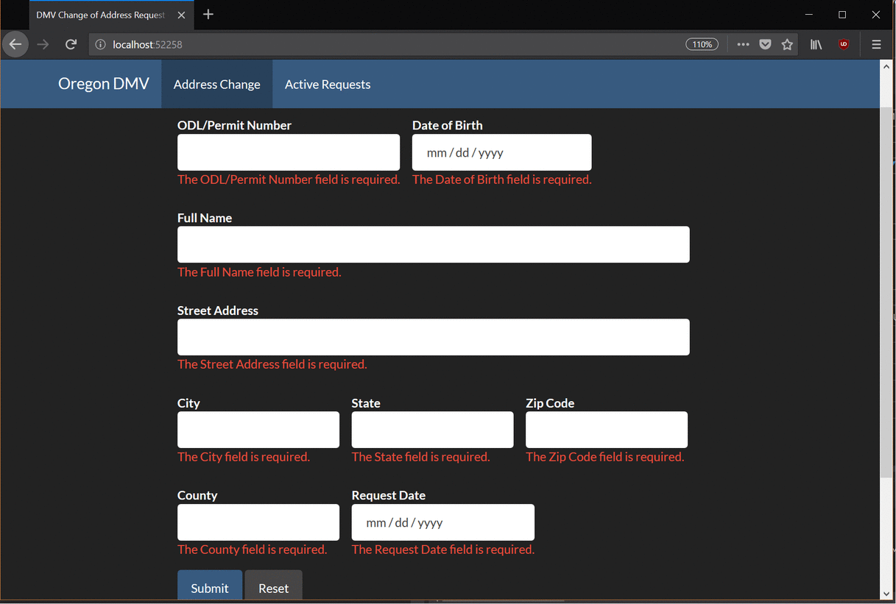

## Homework 5
This homework assignment was about creating a .NET MVC application that uses a simple database, and to become familiar with how models work and learn how to interact with a basic database using .Net MVC. I learned how to use Razor form helpers and how to use C# programming to integrate a web application with a database.

* You can find a description of this project [here](http://www.wou.edu/~morses/classes/cs46x/assignments/HW5.html)
* Demo *unavailable*
* The repository that contains this code can be found [here](https://bitbucket.org/devonsmith/cs460-project-repository)
* https://bitbucket.org/devonsmith/cs460-project-repository.git

### Step 1: Creation of an Empty MVC Project

I began by creating a directory in my CS460 repository and adding a directory for the new project. Then I started Visual Studio, created a new empty MVC application, and added my ```.gitignore``` file to the base directory of the project. After I had the initial setup I needed to use NuGET package manager to install the MVC Entity framework to use in this project.

### Step 2: Took Notes About the Assignment
I reviewed the assignment, which was to create an online DM change of address form much like the one used by the Oregon DMV. I looked over the form and took notes of the fields I would need on the form and the information I would need to store in the database to process the requests.

### Step 3: Creating the Data Model

I started by creating the database and the data model that would interact with that database. Working from my notes, I wrote a script that would create the database for me and add some test data.
```sql
-- Create a table for storing the change of address requests
CREATE TABLE Requests(
    -- unique ID for the change of the request. This is not identified by the user that requested the transfer.
	-- This will auto-increment as new requests are added to the database.
	ID int IDENTITY(0,1) PRIMARY KEY,
	-- The ODL number identifying the person that wants the address change.
	ODL int NOT NULL,
	-- The name of the person requesting the change of address
	FullName VARCHAR(255) NOT NULL,
	-- The date of birth of the person requesting the change.
	DOB DATE NOT NULL,
	-- Street address
	Street VARCHAR(255) NOT NULL,
	-- City
	City VARCHAR(255) NOT NULL,
	-- State 
	USState VARCHAR(2) NOT NULL,
	-- zip
	Zip int NOT NULL,
	-- County
	County VARCHAR(100) NOT NULL
    -- Date Stamp
    DateStamp DATE NOT NULL

);
-- Add Some Testing Values to the database
-- 1 
INSERT INTO Requests (ODL, FullName, DOB, Street, City, USState, Zip, County, DateStamp) 
	VALUES (1000000, 
			'John Smith', 
			'1970-02-26', 
			'123 NE Rainwater Drive', 
			'Albany', 
			'OR', 
			97321, 
			'Linn',
			'2017-06-15'
);
-- 2
INSERT INTO Requests (ODL, FullName, DOB, Street, City, USState, Zip, County, DateStamp) 
	VALUES (1245372, 
			'Sarah Edwards', 
			'1982-04-17', 
			'2916 SW Florence Place', 
			'Monmouth', 
			'OR', 
			97361, 
			'Polk',
			'2017-06-15'
	);
-- 3
INSERT INTO Requests (ODL, FullName, DOB, Street, City, USState, Zip, County, DateStamp)
	VALUES (3456789, 
			'Aiden Cross', 
			'2000-02-15', 
			'8456 SE Sceneca Street', 
			'Portland', 
			'OR', 
			97230, 
			'Multnomah',
			'2017-06-16'
	);
-- 4
INSERT INTO Requests (ODL, FullName, DOB, Street, City, USState, Zip, County, DateStamp)
	VALUES (9508231, 
			'Aithnea Stalenhag', 
			'1994-12-03', 
			'3126 NW Spruce Drive', 
			'Corvallis', 
			'OR', 
			97330, 
			'Benton',
			'2017-06-17'	
	);
-- 5
INSERT INTO Requests (ODL, FullName, DOB, Street, City, USState, Zip, County, DateStamp)
	VALUES (8703621, 
			'Andrea Sweet', 
			'1984-03-23', 
			'4782 W Spring Hills Dr', 
			'Wilsonville', 
			'OR', 
			97322, 
			'Clackamas',
			'2017-06-19'
	);
```
While I was at it, I also created a file that would destroy the database after testing.

```sql
-- Remove the table from this database
DROP TABLE Requests;
```

### Step 4: Create the Data Model Class and Data Context Class
Once I had tested both the scripts, I moved on to creating the model that would interact with my database. This was a straight-forward process. I created a new data type that stored all the data I needed. and created a custom ToString() method for testing and diagnostic purposes should the need arise.

```csharp
using System;
using System.Collections.Generic;
using System.ComponentModel.DataAnnotations;
using System.Linq;
using System.Web;

namespace CS460_Homework_5.Models
{
    /// <summary>
    /// Request object for address change requests
    /// </summary>
    public class Request
    {
        /// <summary>
        /// The automatically generated ID in the database. This is the PRIMARY KEY.
        /// </summary>
        [Required]
        [Display (Name = "Request ID")]
        public int ID { get; set; }
        /// <summary>
        /// The Oregon Driver's License Number or Permit Number that needs to have the
        /// address change.
        /// </summary>
        [Required]
        [Display(Name = "ODL/Permit Number")]
        public int ODL { get; set; }
        /// <summary>
        /// The full legal name of the user requesting the address change.
        /// </summary>
        [Required]
        [StringLength(255)]
        [Display(Name = "Full Name")]
        public string FullName { get; set; }
        /// <summary>
        /// The date of birth for the person requesting the address change.
        /// </summary>
        [Required]
        [DataType(DataType.Date)]
        [Display(Name = "Date of Birth")]
        public DateTime DOB { get; set; }
        /// <summary>
        /// The new street address the user is moving to
        /// </summary>
        [Required]
        [StringLength(255)]
        [Display(Name = "Street Address")]
        public string Street { get; set; }
        /// <summary>
        /// The city the user is moving to
        /// </summary>
        [Required]
        [StringLength(255)]
        [Display(Name = "City")]
        public string City { get; set; }
        /// <summary>
        /// The state that the user is moving to, in this case it should almost always be
        /// Oregon. This is only two characters for the state.
        /// </summary>
        [Required]
        [StringLength(2)]
        [Display(Name = "State")]
        public string USState { get; set; }
        /// <summary>
        /// The numeric postal code of the new address.
        /// </summary>
        [Required]
        [Display(Name = "Zip Code")]
        public int Zip { get; set; }
        /// <summary>
        /// The county in the state the new address resides in.
        /// </summary>
        [Required]
        [StringLength(100)]
        [Display(Name = "County")]
        public string County { get; set; }
        /// <summary>
        /// Today's current date. This should be the date of the request.
        /// </summary>
        [Required]
        [DataType(DataType.Date)]
        [Display(Name = "Request Date")]
        public DateTime DateStamp { get; set; }


        /// <summary>
        /// Override for the ToString method that will output information for this model
        /// </summary>
        /// <returns></returns>
        public override string ToString()
        {
            return $"{base.ToString()}: {ODL} {FullName}  DOB = {DOB} Street = {Street} City = {City} State = {USState} Zip = {Zip} County = {County} ";
        }
    }

}
```
I could then create the Database Context for working with the database. I created the required folder "DAL." I would prefer the more formal and explicit folder name of "Data Access Layer," but since the assignment requires the folder be named "DAL" I used that instead. The database context is what will allow the data in the model to interact with the controller and view. The code for this is simple.

```csharp
using System;
using System.Data.Entity;
using System.Collections.Generic;
using System.Linq;
using System.Web;
using CS460_Homework_5.Models;

namespace CS460_Homework_5.DAL
{
    public class RequestContext : DbContext
    {
        public RequestContext() : base("name=ChangeRequestContext") { }
        public virtual DbSet<Request> Requests { get; set; }
    }
}
```

### Step 5: Connecting to the Database

I could then add the connection string to my Web.Config file. This connection string can be added to my project to tell the web application what location and provider to use to connect to the database. This is used in the Datbase Context to communicate with the database.

```xml
  <connectionStrings>
    <add name="ChangeRequestContext" 
         connectionString="Data Source=(LocalDB)\MSSQLLocalDB;AttachDbFilename=C:\Users\Devon Smith\Documents\CS460\HW5\CS460 Homework 5\App_Data\AddressChangeRequest.mdf;Integrated Security=True" 
         providerName="System.Data.SqlClient"/>
  </connectionStrings>
```
### Step 6: Creating the Controller and Action Methods

Then I could create the controller and the action methods for my pages. This project has two pages, one for creating a new address change request and another to view all the requests that are in the database.

```csharp
 public class HomeController : Controller
    {
        private RequestContext database = new RequestContext();
        // GET: Home
        [HttpGet]
        public ActionResult Index()
        {
            return View();
        }
        [HttpPost]
        [ValidateAntiForgeryToken]
        public ActionResult Index([Bind(Include ="ID, ODL, FullName, DOB, Street, City, USState, Zip, County, DateStamp")] Request request)
        { 
            // Check to see if the model state was good, if it was time to do some work.
            if (ModelState.IsValid)
            {
                // Add the new request ot the database.
                database.Requests.Add(request);
                database.SaveChanges();
                // TempDataDIctionary TempData can be used to move information into a redirect
                // the viewbag and the ViewData and ViewBag cannot.
                TempData["Success"] = "Your request has been logged.";
                return RedirectToAction("Index");
            }
            // Return the the index view with the request
            return View(request);
        }
        // GET: Requests
        public ActionResult Requests()
        {
            // return a view with the DBSet as a list that can be parsed.
            return View(database.Requests.ToList());
        }
    }
```
I created the HttpPost version of the page so it would take all the information and process it. Once the command was complete, the page would place a "Success" message into the TempDataDictionary TempData so I could get the message out in the page and inform the user if their request was logged.

### Step 7: Creating the Views
I could then move onto creating the views. The page for the actual creation of a new request has a partial view that contains all the code for the form. This allows the interface to swap out forms as required. This kind of isolation is probably not necessary for this project, but it's good practice to use partial views.

```html

@{
    ViewBag.Title = "DMV Change of Address Request";
}

<h2>Change of Address Request Form</h2>
<div class="row">
    <!-- left spacer -->
    <div class="col-sm-2"></div>
    <!-- end of left spacer -->
    <!-- Middle content area -->
    <div class="col-sm-8">
        <!-- message if the posting was successful -->
        @if (TempData["Success"] != null)
        {
            Html.RenderPartial("~/Views/Home/StatusOK.cshtml");
        }
        <!-- get partial view for form -->
        @RenderPage("~/Views/Home/ChangeOfAddressForm.cshtml")
    </div>
    <!-- End of content area -->
    <!-- right spacer -->
    <div class="col-sm-2"></div>
    <!-- end of right spacer -->
</div>
```
Here is the contents of the StatusOK.cshtml file.

```csharp
<!-- Present the user with confirmation that they completed their form correctly -->
<div class="alert alert-success">
    <strong>Success:</strong> @TempData["Success"].ToString()
</div>
```

The interesting code is all contained in the form. I used RazorForm helpers to build the form that is used to create the entries in the database. The downside to this method was that it took more time to get it looking exactly the way I wanted. This could have been done faster using HTML, assuming you are more proficient with HTML than Razor. Either way works, but since I have more experience with HTML/CSS I had to explicitly add classes and identifiers to some of the form inputs.

```html
<!-- get the model for the form -->
@model CS460_Homework_5.Models.Request

@using (Html.BeginForm())
{
    @Html.AntiForgeryToken()
    <div class="form-horizontal">
        <div id="identity" class="form-group">
            <div class="left">
                @Html.LabelFor(model => model.ODL, htmlAttributes: new { @class = "control-label" })
                @Html.EditorFor(model => model.ODL, new { htmlAttributes = new { @class = "form-control" } })
                @Html.ValidationMessageFor(model => model.ODL, "", new { @class = "text-danger" })
            </div>
            <div class="left">
                @Html.LabelFor(model => model.DOB, htmlAttributes: new { @class = "control-label" })
                @Html.EditorFor(model => model.DOB, new { htmlAttributes = new { @class = "form-control" } })
                @Html.ValidationMessageFor(model => model.DOB, "", new { @class = "text-danger" })
            </div>
        </div>
        <div id="fullName" class="form-group">
            @Html.LabelFor(model => model.FullName, htmlAttributes: new { @class = "control-label" })
            @Html.EditorFor(model => model.FullName, new { htmlAttributes = new { @class = "form-control fill" } })
            @Html.ValidationMessageFor(model => model.FullName, "", new { @class = "text-danger" })
        </div>
        <div id="addressLineOne" class="form-group">
            @Html.LabelFor(model => model.Street, htmlAttributes: new { @class = "control-label" })
            @Html.EditorFor(model => model.Street, new { htmlAttributes = new { @class = "form-control fill" } })
            @Html.ValidationMessageFor(model => model.Street, "", new { @class = "text-danger" })
        </div>
        <div id="addressLineTwo" class="form-group">
            <div class="left">
                @Html.LabelFor(model => model.City, htmlAttributes: new { @class = "control-label" })
                @Html.EditorFor(model => model.City, new { htmlAttributes = new { @class = "form-control" } })
                @Html.ValidationMessageFor(model => model.City, "", new { @class = "text-danger" })
            </div>
            <div class="left">
                @Html.LabelFor(model => model.USState, htmlAttributes: new { @class = "control-label" })
                @Html.EditorFor(model => model.USState, new { htmlAttributes = new { @id = "state", @class = "form-control", @maxlength="2"} })
                @Html.ValidationMessageFor(model => model.USState, "", new { @class = "text-danger" })
            </div>
            <div class="left">
                @Html.LabelFor(model => model.Zip, htmlAttributes: new { @class = "control-label" })
                @Html.EditorFor(model => model.Zip, new { htmlAttributes = new { @class = "form-control" } })
                @Html.ValidationMessageFor(model => model.Zip, "", new { @class = "text-danger" })
            </div>
        </div>
        <div id="inputLocationDate" class="form-group">
            <div class="left">
                @Html.LabelFor(model => model.County, htmlAttributes: new { @class = "control-label" })
                @Html.EditorFor(model => model.County, new { htmlAttributes = new { @class = "form-control" } })
                @Html.ValidationMessageFor(model => model.County, "", new { @class = "text-danger" })
            </div>
            <div class="left">
                @Html.LabelFor(model => model.DateStamp, htmlAttributes: new { @class = "control-label" })
                @Html.EditorFor(model => model.DateStamp, new { htmlAttributes = new { @class = "form-control"} })
                @Html.ValidationMessageFor(model => model.DateStamp, "", new { @class = "text-danger"})
            </div>
        </div>
        <div class="form-group">
            <input class="btn btn-primary" id="calculate" type="submit" value="Submit" formmethod="post" />
            <input class="btn btn-default" type="reset" value="Reset">
        </div>
    </div>
}
```

Then I made the view page that would allow you to inspect the requests in the database. This was significantly simpler than creating the form. It's just a table with some elements in it created using a foreach loop.

```html
@{
    ViewBag.Title = "Requests";
}
@model IEnumerable<CS460_Homework_5.Models.Request>
<h2>Requests</h2>
<table class="table">
    <tr>
        <th>
            @Html.DisplayNameFor(model => model.ODL)
        </th>
        <th>
            @Html.DisplayNameFor(model => model.FullName)
        </th>
        <th>
            @Html.DisplayNameFor(model => model.DOB)
        </th>
        <th>
            @Html.DisplayNameFor(model => model.City)
        </th>
        <th>
            @Html.DisplayNameFor(model => model.USState)
        </th>
        <th>
            @Html.DisplayNameFor(model => model.Zip)
        </th>
        <th>
            @Html.DisplayNameFor(model => model.County)
        </th>
    </tr>
    @foreach (var item in Model)
    {
        <tr>
            <td>@Html.DisplayFor(modelItem => item.ODL)</td>
            <td>@Html.DisplayFor(modelItem => item.FullName)</td>
            <td>@Html.DisplayFor(modelItem => item.DOB)</td>
            <td>@Html.DisplayFor(modelItem => item.City)</td>
            <td>@Html.DisplayFor(modelItem => item.USState)</td>
            <td>@Html.DisplayFor(modelItem => item.Zip)</td>
            <td>@Html.DisplayFor(modelItem => item.County)</td>
        </tr>
    }
</table>
```
I customized the layout for this page to add navigation and to add classes to the navigation bar based on page routing. I also added a warning message to the footer of the page to inform users that this is not an official Oregon DMV page.
 
```html
<!DOCTYPE html>
<html>
<head>
    <meta charset="utf-8" />
    <meta name="viewport" content="width=device-width, initial-scale=1.0">
    <title>@ViewBag.Title - My ASP.NET Application</title>
    <link href="~/Content/Site.css" rel="stylesheet" type="text/css" />
    <link href="~/Content/bootstrap.min.css" rel="stylesheet" type="text/css" />
    <script src="~/Scripts/modernizr-2.6.2.js"></script>
</head>
<body>
    <div class="navbar navbar-default navbar-fixed-top">
        <div class="container">
            <div class="navbar-header">
                <button type="button" class="navbar-toggle" data-toggle="collapse" data-target=".navbar-collapse">
                    <span class="icon-bar"></span>
                    <span class="icon-bar"></span>
                    <span class="icon-bar"></span>
                </button>
                @Html.ActionLink("Oregon DMV", "Index", "Home", new { area = "" }, new { @class = "navbar-brand" })
            </div>
            <div class="navbar-collapse collapse">
                <ul class="nav navbar-nav">
                    <li class="@(ViewContext.RouteData.Values["Action"].ToString() == "Index" ? "active" : "")">
                        @Html.ActionLink("Address Change", "Index", "Home", new { area = "" }, new { @id = "menu1" })
                    </li>
                    <li class="@(ViewContext.RouteData.Values["Action"].ToString() == "Requests" ? "active" : "")">
                        @Html.ActionLink("Active Requests", "Requests", "Home", new { area = "" }, new { @id = "menu2" })
                    </li>
                </ul>
            </div>
        </div>
    </div>
    <div class="container body-content">
        @RenderBody()
        <hr />
            <small>
                This is a demonstration website and not officially associated with the Oregon DMV.
                This page is intended for educational purposes only.
            </small>
        <hr />
        <footer>
            <p>&copy; @DateTime.Now.Year - Devon Smith</p>
        </footer>
    </div>

    <script src="~/Scripts/jquery-1.10.2.min.js"></script>
    <script src="~/Scripts/bootstrap.min.js"></script>
</body>
</html>
```

### Project Complete
Finally, I tested the webpage and was able to view the test data I created in my database. I was also able to add information to the database.

