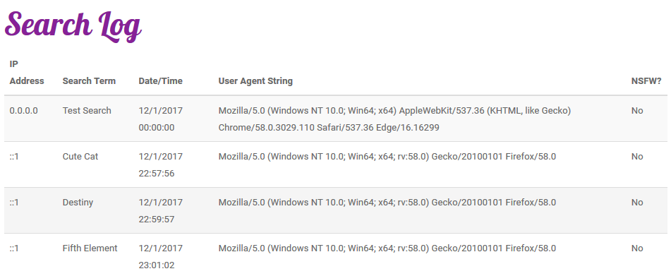
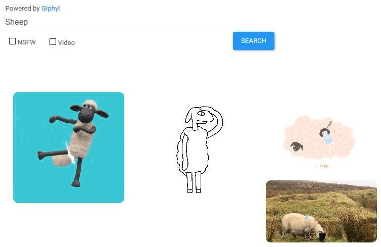

## Homework 7
This homework assignment is about learning how to use a REST API to create an application. We will use C# 7.0, MVC 5,and JavaScript to create a web application that uses the Giphy web API to search Giphy to find animated gif images. In addition to using the API we need to do some server-side processing based on user interaction. We will also need to create some user interaction that is processed client-side.

* The assignment page can be found [here](http://www.wou.edu/~morses/classes/cs46x/assignments/HW7.html).
* The repository that contains this code can be found [here](https://bitbucket.org/devonsmith7696/cs460-project-repository)
* Live Demo Unavialable

Note for this log I decided to write the log as a series of requirements instead of a sequence of steps. This should make the journal easier to read and find the content that matches the project requirements.

### Requirement 1
*Has a single page JavaScript application; all functionality is driven by AJAX calls.* This application uses a single page for the search and all of the options selected by the user are used to create the server AJAX call or to create the layout of the page.

Here is the view code that generates the HTML for the page.
```html
@{
    ViewBag.Title = "Home";
}

<h1 class="fancy-text">Animated Image Search</h1>
<div class="row">
    <div class="col-lg-1"></div>
    <div class="col-lg-10">
        <form class="form-horizontal">
            <div class="form-group">
                <label class="col-lg-2 control-label" for="searchGiphy">Powered by <a href="https://giphy.com">Giphy</a>!</label>
                <div class="col-lg-10">
                    <input id="searchGiphy" type="text" placeholder="Search"><br />
                    <input id="searchButton" type="button" class="btn btn-primary" value="Search" />
                    <div id="nsfwPanel" class="checkbox">
                        <label>
                            <span id="nsfwContainer">
                                <input id="nsfw" type="checkbox"> NSFW
                            </span>                            
                        </label>
                    </div>
                    <div id="videoPanel" class="checkbox">
                        <label>
                            <span id="videoContainer">
                                <input id="video" type="checkbox" /> Video
                            </span>
                        </label>
                    </div>
                </div>
            </div>
        </form>
    </div>
    <div class="col-lg-1"></div>
</div>
<div class="row">
    <div id="searchContainer" class="col-sm-12"></div>
</div>
@section PageScripts
{
    <script type="text/javascript" src="~/Scripts/JavaScript.js"></script>
}
```

The JavaScript that drives this page's content can be found in Requirement 2

Here is the Controller for this page:
```csharp


```


Here is the model for the Giphy image data that is received when a search is performed:

### Requirement 2
*JavaScript is n a separate file in the Scripts folder and is included via ```@section```. The JavaScript file uses JQuery.*

Home/Index.cshtml
```html
@section PageScripts
{
    <script type="text/javascript" src="~/Scripts/JavaScript.js"></script>
}
```

_Layout.cshtml which contains the reference to PageScripts section.
```html
<!DOCTYPE html>
<html>
<head>
    <meta charset="utf-8" />
    <meta name="viewport" content="width=device-width, initial-scale=1.0">
    <title>@ViewBag.Title - CS460 Homework 7</title>
    <link href="~/Content/Site.css" rel="stylesheet" type="text/css" />
    <link href="~/Content/bootstrap.min.css" rel="stylesheet" type="text/css" />
    <script src="~/Scripts/modernizr-2.6.2.js"></script>
</head>
<body>
    <div class="container body-content">
        @RenderBody()
        <hr />
        <footer>
            <p>&copy; @DateTime.Now.Year | Devon Smith | Western Oregon University</p>
        </footer>
    </div>

    <script src="~/Scripts/jquery-3.2.1.min.js"></script>
    <script src="~/Scripts/bootstrap.min.js"></script>
    @RenderSection("PageScripts", required: false)
</body>
</html>

```

Here is the JavaScript.js file that does all the processing for the user requests and performs the AJAX operations.

```js
// Action for the search button being clicked.
$("#searchButton").click(function () {
    var urlString = ($("#nsfw").prop("checked") == true) ? "/Search/nsfw?q=" : "/Search?q=";
    if ($("#labelStickers").hasClass("label-success")) {
        urlString += "&s=stickers";
    }
    $.ajax(
        {
            type: "GET",
            dataType: "json",
            url: urlString + $("#searchGiphy").val(),
            success: function (data) { displayData(data); },
            error: function () { ajaxError(); }
        }
    );
});


// Actions for the NSFW check box to make your selection more obvious.
$("#nsfw").click(function () {
    if ($("#nsfw").prop("checked") == true) {
        $("#nsfwPanel").addClass("nsfw");
    }
    else {
        $("#nsfwPanel").removeClass("nsfw");
    }
});

// Actions for the NSFW check box to make your selection more obvious.
$("#video").click(function () {
    if ($("#video").prop("checked") == true) {
        $("#videoPanel").addClass("video");
    }
    else {
        $("#videoPanel").removeClass("video");
    }
});

// Display the data returned from the search.
function displayData(data) {
    $("#searchContainer").empty();
    if ($("#video").prop("checked") == true) {
        $.each(data, function (i, image) {
            $("#searchContainer").append(
                "<div class='img-box col-lg-4'>"
                + "<video loop autoplay>"
                + "<source src='"
                + image["mp4"]
                + "' type='video/mp4'>"
                + "<source src='"
                + image["webp"]
                + "' type='video/webp'>"
                + "</video>"
                + "</div>"
            );
        });
    }
    else {
        $.each(data, function (i, image) {
            $("#searchContainer").append(
                "<div class='img-box col-lg-4'><a href='"
                + image["url"]
                + "' target='_new'></a>"
                + "</div>"
            );
        });
    }
}

// if there is an error, return it.
function ajaxError() {
    alert("Warning: Unable to perform search. Please try again later.");
}
```

### Requirement 3
*Uses at least one custom routing rule in ```RouteConfig.cs``` that makes sense and routes to a new controller that isn’t Home* The custom route created for this allows the application to search using ```/Search?q=kitty``` or ```/Search/nsfw?q=kitty``` depending on if they want to get back NSFW content or would prefer a safe search.

```csharp
// Additional Route for Giphy Search
routes.MapRoute(
    name: "Search",
    url: "Search/{safeSearch}",
    defaults: new { controller = "Search", action = "Search", safeSearch = UrlParameter.Optional }
);
```

### Requirement 4
*Has custom CSS in Contents;  page looks nice* This page contains a number of custom CSS classes for the various page elements.

```css
#searchGiphy{
    width: 50vw;
    max-width: none;
}

#searchButton{
    position: relative;
    margin-top: 5px;
    left: 44vw;
}

#nsfwPanel {
    position: relative;
    top: -30px;
    padding: .2em .6em .3em;
    border-radius: .25em;
    width: 75px;
}

#videoPanel {
    position: relative;
    top: -60px;
    left: 80px;
    padding: .2em .6em .3em;
    border-radius: .25em;
    width: 75px;
}

.img-box{
    float: left;
    width: 250px;
    padding: 5px;
}

.nsfw {
    background-color: #e51c23;
    color: #fff;
}

.video {
    background-color: #2196f3;
    color: #fff;
}

.fancy-text {
    font-family: 'Lobster', cursive;
    color: #862197;
}

img{ 
    border-radius: 1rem;
}

video {
    border-radius: 1rem;
}
```


### Requirement 5
*Has a database for Logging; successfully logs every request; uses a script to create this database* This page has a database that is used to log user information.

Here is the script used to create the database table:
```sql
CREATE TABLE UserAccessLogs(
ID int IDENTITY(0,1) PRIMARY KEY,
SearchString NVARCHAR(255) NOT NULL,
AgentString NVARCHAR(1024) NOT NULL,
TimeStamp DATETIME NOT NULL,
IPAddress NVARCHAR(64) NOT NULL,
NSFW NVARCHAR(5) NOT NULL
);

-- create some sample data
INSERT INTO  UserAccessLogs(SearchString, AgentString, TimeStamp, IPAddress, NSFW)
VALUES ( 'Test Search', 
		 'Mozilla/5.0 (Windows NT 10.0; Win64; x64) AppleWebKit/537.36 (KHTML, like Gecko) Chrome/58.0.3029.110 Safari/537.36 Edge/16.16299',
		 '2017-12-01 00:00:00',
		 '0.0.0.0', 
		 'False');

```

Here is the code from the search controller that logs the requests:
```csharp
 /********************* Logging of user search data ****************************/
            // create the log item.
            var log = database.UserAccessLogs.Create();
            // What did the user search for?
            log.SearchString = Request.QueryString["q"];
            // The user agent string.
            log.AgentString = Request.UserAgent;
            // The time of the transaction
            log.TimeStamp = DateTime.Now;
            // The IP address of the request.
            log.IPAddress = Request.UserHostAddress;
            // Was the user looking for nsfw content?
            log.NSFW = (nsfwSearch) ? "True" : "False";
            // Add the information to the database.
            database.UserAccessLogs.Add(log);
            // save the changes to the database.
            database.SaveChanges();
```

Here is the model for log:
```csharp
namespace CS460_Homework_7.DAL
{
    using System;
    using System.Collections.Generic;
    using System.ComponentModel.DataAnnotations;
    using System.ComponentModel.DataAnnotations.Schema;
    using System.Data.Entity.Spatial;

    public partial class UserAccessLog
    {
        public int ID { get; set; }

        [Required]
        [StringLength(255)]
        public string SearchString { get; set; }

        [Required]
        [StringLength(1024)]
        public string AgentString { get; set; }

        public DateTime TimeStamp { get; set; }

        [Required]
        [StringLength(64)]
        public string IPAddress { get; set; }

        [Required]
        [StringLength(5)]
        public string NSFW { get; set; }
    }
}

```

For fun I created a page that allows you to view the stored requests in the log.


### Requirement 6
*The page works, searches Giphy and shows results in a grid; is responsive*

This page creates a grid of images or videos based on the user query.


### Requirement 7
*Uses JSON for AJAX calls; JSON object is used client-side to modify the DOM and build the search results*

Uses JavaScript to make an AJAX call to the server
```js
$("#searchButton").click(function () {
    var urlString = ($("#nsfw").prop("checked") == true) ? "/Search/nsfw?q=" : "/Search?q=";
    if ($("#labelStickers").hasClass("label-success")) {
        urlString += "&s=stickers";
    }
    $.ajax(
        {
            type: "GET",
            dataType: "json",
            url: urlString + $("#searchGiphy").val(),
            success: function (data) { displayData(data); },
            error: function () { ajaxError(); }
        }
    );
});
```


Gets the content back from the server as JSON and create the grid from it.

Here is a sample of the JSON response:
```js
[{"url":"https://giphy.com/gifs/kawaii-flowers-cat-6RuhlzSdhIAqk","preview":"https://media0.giphy.com/media/6RuhlzSdhIAqk/giphy.gif","mp4":"https://media0.giphy.com/media/6RuhlzSdhIAqk/200w.mp4","webp":"https://media0.giphy.com/media/6RuhlzSdhIAqk/200w.webp"},{"url":"https://giphy.com/gifs/cat-kitten-kitty-VxbvpfaTTo3le","preview":"https://media3.giphy.com/media/VxbvpfaTTo3le/giphy.gif","mp4":"https://media3.giphy.com/media/VxbvpfaTTo3le/200w.mp4","webp":"https://media3.giphy.com/media/VxbvpfaTTo3le/200w.webp"},{"url":"https://giphy.com/gifs/trippy-kitty-acid-cXaeWuJ1oKO4g","preview":"https://media1.giphy.com/media/cXaeWuJ1oKO4g/giphy.gif","mp4":"https://media1.giphy.com/media/cXaeWuJ1oKO4g/200w.mp4","webp":"https://media1.giphy.com/media/cXaeWuJ1oKO4g/200w.webp"},{"url":"https://giphy.com/gifs/hallmarkecards-cats-kitty-l0HlGRDhPTqVEvhCw","preview":"https://media2.giphy.com/media/l0HlGRDhPTqVEvhCw/giphy.gif","mp4":"https://media2.giphy.com/media/l0HlGRDhPTqVEvhCw/200w.mp4","webp":"https://media2.giphy.com/media/l0HlGRDhPTqVEvhCw/200w.webp"}, ... ]
```

From that JSON data creates the grid of the images for the user to view.
```js
$.each(data, function (i, image) {
    $("#searchContainer").append(
        "<div class='img-box col-lg-4'><a href='"
        + image["url"]
        + "' target='_new'></a>"
        + "</div>"
    );
});
```

### Requirement 8
*Has additional client side options/functionality, beyond simple search by topic.* There are a number of client-size user interface operations that happen using JavaScript. When a user checks a checkbox for either NSFW or Video the check box will highlight and let them know at a quick glance that they have the element checked. Additionally, if they check the video checkbox the JavaScript will create a grid using videos instead of gifs. In many situations video files can be smaller than actual gif images and this can save data on devices over metered connections.

Here the JS will deliver the video grid:
```js
// Display the data returned from the search.
function displayData(data) {
    $("#searchContainer").empty();
    if ($("#video").prop("checked") == true) {
        $.each(data, function (i, image) {
            $("#searchContainer").append(
                "<div class='img-box col-lg-4'>"
                + "<video loop autoplay>"
                + "<source src='"
                + image["mp4"]
                + "' type='video/mp4'>"
                + "<source src='"
                + image["webp"]
                + "' type='video/webp'>"
                + "</video>"
                + "</div>"
            );
        });
    }
```
Otherwise, the application will render a grid using gif images
```js
    else {
        $.each(data, function (i, image) {
            $("#searchContainer").append(
                "<div class='img-box col-lg-4'><a href='"
                + image["url"]
                + "' target='_new'></a>"
                + "</div>"
            );
        });
    }
}
```

### Requirement 9
*Has additional server side processing (beyond topic search).* This application allows the use to choose if they want to view "Not Safe For Work" or "NSFW" content. When the user checks a checkbox the will return a list of gifs that will also contain violent or sexually explicit content. This is performed using a custom route and the server will process the information and deliver a JSON object to the client.

This selection is handled in the search controller:
```csharp
 bool nsfwSearch = (safeSearch == "nsfw");
// set the rating of the search to get back from the Giphy API.
string rating = (nsfwSearch) ? "r" : "g";


/************ Things that are dynamically created ****************************************/
// The URL for the content
string uri = "https://api.giphy.com/v1/gifs/search?api_key="
            + System.Web.Configuration.WebConfigurationManager.AppSettings["giphyAPIKey"]
            // The user's query
            + "&q=" + Request.QueryString["q"]
            // The rating requested by the user.
            + "&rating=" + rating
            // Always use English.
            + "&lang=en";
```


### Video Demonstration

<iframe width="560" height="315" src="https://www.youtube.com/embed/5jp6wzQLVgI?rel=0&amp;showinfo=0&amp;playlist=5jp6wzQLVgI&amp;loop=1&autoplay=1" frameborder="0" gesture="media" allow="encrypted-media" allowfullscreen></iframe>