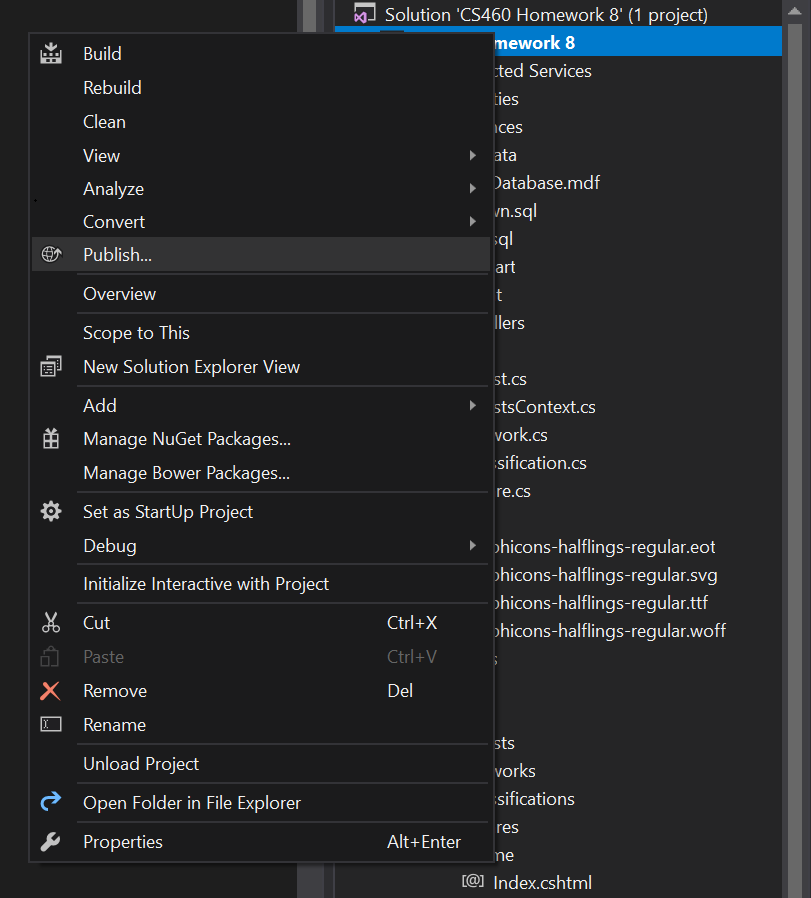

## Homework 9
This homework assignment is about learning how to publish a web application that uses a relational database we created and AJAX to a hosting provider. We will use Microsoft Azure for the hosting of this web app and its database. For the web app we will be using the Homework 8 Project.

* The assignment page can be found [here](http://www.wou.edu/~morses/classes/cs46x/assignments/HW9.html).
* The repository that contains this code can be found [here](https://bitbucket.org/devonsmith7696/cs460-project-repository)
* ~~Deployed Website on Microsoft Azure~~ *No longer available*

### Step 1: Initial Setup of Server and Empty Database
I already had a Microsoft account and had to activate my Azure account. Once the Azure account was created I the SQL Server with an Empty Database and then created a new ```Web App + SQL``` server.


### Step 2: Configuring the Database and Adding a Firewall Rule
Once the database was created and the server was up and running I needed to create a firewall rule that would allow my laptop to connect to the database server.


### Step 3: Adding the Tables
Once I added a firewall rule to the database server so I could access the database directly from SQL Server Management Studio 17. Inside SQL Server Management Studio 17 I ran my ```up.sql``` script and configured the database for my application


### Step 4: Getting the Server Connection String
Once I did that I needed to get the database connection string from the Azure dashboard.


### Step 5: Add Connection String to App
From the Azure dashboard I added the ConnectionString to the configuration of my Web App.


### Step 6: Setting the Context String
To make sure the App would work correctly I added the database context name to the config for the hosted Web app. This would replace the Web.Config in the local version of the app in my development environment when it was published to the web.


### Step 7: Publishing the Web App
Once I had configured all of the server settings I was ready to deploy. I alternate-clicked on my project and selected "Publish...".



### Step 8: Publish Existing Web App
Since i had created the web app before attempting to deploy it to Azure I selected Microsoft Azure App Service and clicked on "Select Existing" before pressing the publish button


### Step 9: Selecting the Database
I selected the database that I wanted the app to connect to on Azure and published the web app.


### Step 10: Finished!
I now had a working demonstration of Homework 8 hosted on Microsoft Azure.
