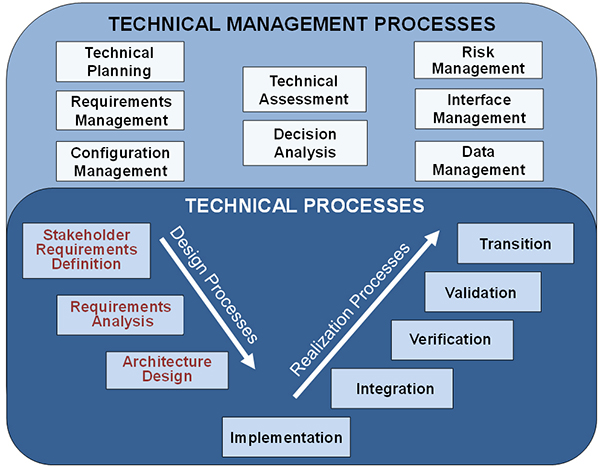

### Disciplined Agile Delivery
#### Why DAD and Where Did It Come From?
Software engineering is complex and we need processes, methodologies, and squences that enable us to develop software in an organized way.

The idea behing DAD is to get software to have a organized and structured process. This way software can be developed and engineered just like anything else that's engineered. Everything from complex machinery to bridges have a process they go through and a system that keeps hundreds of engineers organized.

#### Technical Management Process 
Most types of engineering use a waterfall process. This process is used to organize engineering topics and processes to ensure the project is completed in a safe and complete manner.

The problem with this model really was that the way software was developed there isn't much of a way to deal with dynmaic changes in the software during the development. Often software engineering has significant functional changes to the software during the development process.

You can't just say the software will have x features and will perform y way. That's just not how these things work. Software is also not a "finish and move on" model. Software is complex and like a big machine needs constand maintenance and improvement for the entire time that software is in use.

Before there was Agile there was **SWEBOK** or the Software Engineering Book of Knowledge which is a huge book full of processes and practices and is still used some today. This is like the engineering handbook that all engineers have.

#### The Agile Manifesto
The agile movement was started in the early 2000s and was really created by software development practitioners that were feeling stressed our and overworked by organizational systems that didn't fit the workflow they needed for their jobs. This resulted in the creation of the "Agile Manifesto" which was a collection of opinions about software development and why the waterfall method didn't work.

One of the biggest problems with the waterfall method or more importantly the way some software development compnaies were handling software development was changes to the sotware's functionality become increasingly more expensive to create over time. 
* Redesigning a database is expensive and time consuming
* Implementing new security models changes the entire way software operates.

With software there is more uncertinaty and risk associated with any uncertainty than in other disciplines. In comparison to other engineering disciplines software engineering is significantly more creative and constantly changing. What are good practices today might not be good practices in four years, or ten years.

The agile manifest came out of a need to change the priorities of the software development teams
* Individuals and interactions over processes and tools
* Working software of comprehensive documentation
* Customer collaboration over contract negotiation
* responding to change over development contracts

#### The Needs in the Manifesto

What the writers of the Agile Manifesto believe was that they needed to prioritize the needs of the customer and facilitate interaction with the customer early and with continuous delivery of working software versions (even if some of this "working software" was prototypes).

They wanted to deliver software in a coupel of days of a couple of weeks instead of deliver a finsihed product at the end of a development cycle. They wanted to have early and continuous discussion with the customer and facilitate the creation of the software they wanted and needed.

The people that created the manifesto were not teachers or students, but they were practitioners working in the trenches to develop software for people and buisnesses. They believed that continuous comunication was essential to getting work done in a timely manner.

They wanted to build project around motivated individuals and give them the support they needed to get the work done.

They believes the working software was the primary measure of success. Not some arbitrary metrics or personality trais.

**Note:** Agile is not a solution for everything, but it is very effective under a variety of development cases.

### Disciplined Agile Delivery

The Agile manifesto caused significant upheaval which resulted in all kinds of things in software development being reexamined. DAD is an analysis of that core Agile development model and outlines how Agile can be improved by mixing it with other software techniques.

The aruge that the DAD process is scalable tolage development teams. 

**Scot says:** Agile seems to work better wtih smaller teams.

The disciplined agile principles are basically the same as the Agile principles in the manifesto but with some important differences and clarifications.

### LEAN Principles
LEAN is a process that was developed for entineering that is very much about eliminating waste and improving the quality of the products produced.

* Eliminate waste; build in quality, 
* Create knowledge; defer commitment.
* deliver quickly; Respect People
* Optimize the whole; Visualize the workflow
* Limit work-in-progress

On work on on thins at a time. Choose a rask and do it. This started at toyta with a big white board of things that needed to be done. They would just pick up the task and move forward with it.

#### Reality over Rhetoric
The truth is that requrements evolve and the product evolves. The scope of a project should be limited but you still have to be flexible within those limits.

Teams should be self-assembling and people should be able to choose the people they wante to work with on their teams. That doens't mean it should be like dodgeball in the school yard, but you software developers should be able to self regulate and self organize.

### Scrum
Scrum is a team and process which has a specific pattern of iteration. These are carried out in sprints whish are the actual code development and where the work gets done.

Right now in software development SCRUM is extremely popular. SCRUM get broken down into:
* What is the minimum state of the deliverables
* What features look like.

Contracts exist in the software development world but they are not a measure of success. While contracts are essential for a business to operate they are not fundamental to the software development process.

### Agile Modeling
This is a methodology or effective modeling and documentation.

* Just enough modeling; just barely good enough(kiss)
* Modeling at all phases of construction; model storming
* Document continuously, but late
* Execurable specifications; executable customer tests are better than a diagram
* Test driven development

Sprints are you work interation process. At the beginning there is some modeling done for laying out the process. The fundamental work should be TDD.

Do be afraid of database refactoring. It gets harder as a project goes on so if you can do it early in the process this is better. Many salty database admins don't like refactoring out of fear that something might break, but you really should be able to refactor your database if you absolutely have to.

The fundamental goal of this type of software engineering it to minimize the risk as soon as possible. Ideally there is a steady increate in the value proposition of the software but you also see a steep decline in the risk as the development continues.

#### How Can We Minimize Risk?
* Figure out what you're doing with the software early and start working from there. 
* Choose the appropriate tools as early as possible and confirm the architecture of your software early.

### Rights Roles and Responsibilities

Par of the DAD process is about defining how the poele are ogranized.

* **Role** a part that you play in a given situation.
* **Right** Something to which you have a just claim.
* **Responsibility** Somthin you're requred to do at a certain point in the development cycle.

Everyone deserves:
* To be treated with respect
* to have decision made in a timely manner
* To produce and recieve quality work at all times on the agreed upon project standards and principles.
* To estimate the activities you are actively involved in, and to have those estimates repected by others. These estimates should be as agressive as possible but still achievable.

Every year without fail there are teams that work well together and get things done, but there are other teams that fall apart.

* To be provided adequate resources, including but not limited to time and money, to do the job that been asked of you.
* To have commitments made to you honored, and in the case where that's not possible have alternatives negotiated with your in a timely manner.
* to be given and opportunity to gain the knowledge and skills pertinent to making software development successful.

#### Responsibilities of Everyone
Everyone in a software development life-cycle have responsibilities that need need to meet. 

* Produce a solution that best meets your stakeholders needs with the time and resources they're willing to commit.
*To optimize your organizations resources (time and money) invested in your team/project.

**In Class:** Help people if they're falling behing on their assignments. You never know when you might work with them. Your teams are picked for you so if you can limit the classes global technical debt you'll be in good shape.

